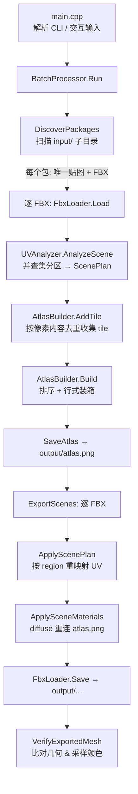

# PolyX 架构说明

本文面向开发者，描述 PolyX 的整体流程、模块划分、核心算法与关键数据结构，作为后续迭代的参考底图。

---

## 1. 分层架构

```
app/   ── 编排层：CLI 入口 + 全流程驱动
 │        main.cpp           参数解析、交互输入、尺寸归一化、调用 BatchProcessor
 │        BatchProcessor     发现包 → 分析 → 打包 → 导出 → 校验
 │
uv/    ── 分析层：UVAnalyzer  把网格 UV 映射为"区域 → 源贴图矩形"的计划
atlas/ ── 资源层：AtlasBuilder 装箱打包 + GDI+ PNG 读写；TgaLoader 自写 TGA 解码
fbx/   ── 适配层：FbxLoader   Autodesk FBX SDK 的导入/导出封装
core/  ── 基础层：Config 命令行解析；Logger 计数式日志
```

依赖方向自上而下：`app → {uv, atlas, fbx, core}`，`uv → {atlas, core}`，`atlas` 自含。无循环依赖。

---

## 2. 端到端流程



### 阶段职责

| 阶段 | 入口 | 输入 | 输出 |
|------|------|------|------|
| 发现包 | `DiscoverPackages` | `input/` | `PackageInfo[]`（贴图 + FBX 列表） |
| UV 分析 | `UVAnalyzer::AnalyzeScene` | FBX 场景 + 源贴图 | `ScenePlan`（区域→矩形、唯一 tile） |
| 收集瓦片 | `AtlasBuilder::AddTile` | `TileCandidate` | 去重后的待打包 tile |
| 打包 | `AtlasBuilder::Build` | tile 集合 | `atlas.png` + `AtlasEntry`（tile→图集矩形） |
| 导出 | `ExportScenes` / `ApplyScenePlan` | 原 FBX + ScenePlan + 图集 | 改写后的 FBX |
| 校验 | `VerifyExportedMesh` | 原 FBX + 输出 FBX + 图集 | 告警日志 |

---

## 3. 核心算法

### 3.1 区域分组（Union-Find）

`UVAnalyzer::AnalyzeScene`（[uv/UVAnalyzer.cpp](../uv/UVAnalyzer.cpp)）对每个网格的**第一个 UV 集**：

1. **Phase 1** 遍历多边形顶点，取其 UV direct-array 索引 `dIdx`（区分 direct / indexToDirect 引用模式），建立 `poly→dIdx 列表` 与 `dIdx→poly 列表`。
2. **Phase 2** 对每个被多个多边形共享的 `dIdx`，用并查集 `Unite` 这些多边形 —— 即**共享 UV 顶点 ⇒ 同一区域**（等价于按 UV 岛聚类）。
3. **Phase 3** 按并查集根分组多边形。
4. **Phase 4** 每个区域：把所有 UV 量化到 **8×8 纹素块原点**，求包围盒 → 区域矩形（裁剪到贴图边界），抽取为 tile 并去重，记录 `RegionMapping`（tileKey + 原点 + 尺寸）与 `polyToRegion[poly] = regionId`。

> **量化**：`QuantizeToBlockOrigin` 把 UV 映射到纹素坐标后按 8 取整（注意 V 轴翻转：`texelY = (1 - v) * H`）。

### 3.2 瓦片去重

`BuildTileKey` 用 `宽x高|原始像素字节` 作为 key，**像素完全一致即视为同一 tile**。`AtlasBuilder::AddTile` 二次校验 key 冲突时内容是否真的相同，不同则报错。

### 3.3 图集打包（行式装箱）

`AtlasBuilder::Build`（[atlas/AtlasBuilder.cpp](../atlas/AtlasBuilder.cpp)）：

1. 按 **高度降序 → 宽度降序 → key** 排序 tile。
2. **自动尺寸**：以 `max(最大边长, ceil(√总面积))` 为起点求最小 2 的幂正方形，逐步翻倍直到能装下。
3. **行式装箱**：从左到右铺，超宽则换行，行高取该行最高 tile。
4. 分配像素缓冲，逐 tile `Blit` 到图集对应位置。

> 装箱是简单 shelf 算法，对小尺寸 tile 足够；瓦片间**无间距（gutter）**。

### 3.4 UV 重映射

`BatchProcessor::ApplyScenePlan` 的 `remapUvRegion`（[app/BatchProcessor.cpp](../app/BatchProcessor.cpp)）把原 UV 在源区域内的相对位置，线性映射进图集 tile 矩形，并做**半纹素内缩**（`±0.5/atlasSize`）防止采样到相邻 tile 渗色。每个 `dIdx` 只写一次（`dIdxWritten` 去重）。

### 3.5 导出校验

`VerifyExportedMesh` 重新加载输出 FBX，比对：网格数量、控制点数 / 多边形数（几何是否被破坏）、以及**逐多边形顶点采样颜色**（原 UV 取源贴图色 vs 新 UV 取图集色，容差 5），不一致则告警并打印前若干条明细。

---

## 4. 关键数据结构

| 结构 | 位置 | 含义 |
|------|------|------|
| `AppConfig` | core/Config.h | 根目录、输入/输出目录、图集尺寸、是否自动尺寸、verbose 等 |
| `ScenePlan` | uv/UVAnalyzer.h | 每个网格的 `MeshPlan` + 全场景唯一 tile + 主 UV 集名 |
| `MeshPlan` | uv/UVAnalyzer.h | `regions`（区域→源矩形映射）+ `polyToRegion`（多边形→区域） |
| `RegionMapping` | uv/UVAnalyzer.h | tileKey + 源贴图上的原点/尺寸 |
| `TileCandidate` | uv/UVAnalyzer.h | 唯一 tile：key + 源矩形 + 像素 |
| `Image` / `Rect` | atlas/AtlasBuilder.h | RGBA8 图像 / 矩形 |
| `AtlasEntry` | atlas/AtlasBuilder.h | tile 在图集中的落位（key + sourceRect + atlasRect） |

> ⚠️ `uv/UVAnalyzer.h` 中还存在一批 **0.2.0 重构后未清理的遗留结构**（`TrianglePlan`/`LayerPlan`/`CellMapping`/`PolyStripMapping`/`CellCoord`/`PolyKey` 等），以及 `.cpp` 中未被调用的旧瓦片选择路径（`ChooseTileRect` / `BuildSampleRect` / `Score*`）。详见 [CLEANUP.md](CLEANUP.md)。

---

## 5. 图片 I/O

- **读取**：`LoadImageFile` 按扩展名分流——`.tga` 走自写 `TgaLoader`（支持未压缩 / RLE、灰度、16/24/32bpp），其余走 GDI+ `Bitmap`。统一转为 **RGBA8**（内部存 RGBA，GDI+ 读出的 BGRA 会做 R↔B 交换）。
- **写出**：`SaveImagePng` 用 GDI+ PNG 编码器，写出时再做一次 RGBA→BGRA 交换。

---

## 6. 已知约束

- **仅 Windows**：GDI+ / `conio.h` / `Windows.h`。
- **强假设源贴图为"色块/小渐变条"风格**：8×8 量化对调色板式贴图合适，对高频连续贴图会丢失精度。
- **FBX 重复加载**：分析与导出阶段各自加载，单个文件最多被读 3~4 次。

---

## 7. 设计规则与常量（core/Constants.h）

底层稳定规则集中在 [core/Constants.h](../core/Constants.h)，作为单一出处，避免魔法数散落各处：

| 常量 | 值 | 含义 / 规则 |
|------|----|------------|
| `kTextureBlockSize` | 8 | 贴图块大小（像素）。美术统一按 8px 网格作图，UV 区域量化（`QuantizeToBlockOrigin`）与区域矩形尺寸均以此为基本单元。几乎不改动。 |
| `kAtlasGutter` | 0 | 图集瓦片间距（像素）。本项目 polygon 风格、不使用 mipmap，瓦片紧贴排列即可、不会渗色——**零间距是有意规则**，并在 `AtlasBuilder` 装箱处显式引用。若将来引入 mipmap 再评估。 |

> **编码约定**：源码注释保持 ASCII / 英文。MSVC 默认按系统代码页（cp936）编译源码，非 ASCII 注释在无 `/utf-8` 时可能破坏其后声明。中文说明放在文档（本目录）中，而非代码注释里。相关改进见 [BACKLOG.md](BACKLOG.md) 第 12 项。

后续优化项见 [BACKLOG.md](BACKLOG.md)。
